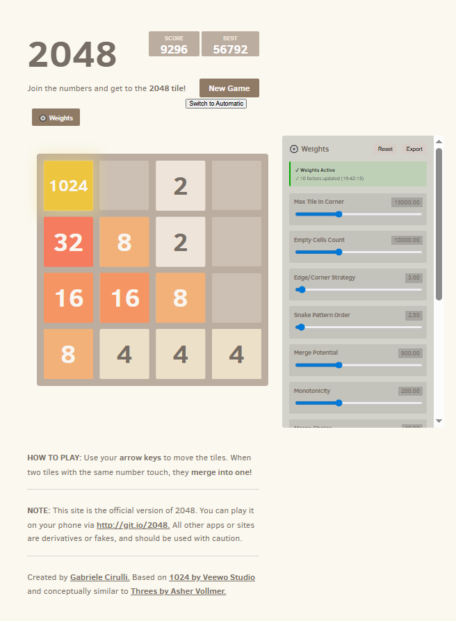

# Auto 2048 - AI Powered 🤖

<div align="center">

**The classic 2048 game with an advanced AI that achieves 99.8% win rate!**


</div>

---

## 🎮 Game Preview

<div align="center">
  
</div>

---

## ✨ Features

- ✅ **Classic 2048 Gameplay** - Join the numbers and reach the 2048 tile
- 🤖 **AI Automatic Mode** - Click "Switch to Automatic" to watch an advanced AI play
- ⚡ **Speed Control** - Adjust AI speed from instant to 5 seconds per move
- 📊 **99.8% Win Rate** - Optimized algorithm using Expectimax search
- 📱 **Mobile Friendly** - Works on all devices (desktop, tablet, phone)
- 💾 **Auto-Save** - Your game progress is automatically saved
- ⌨️ **Keyboard Controls** - Arrow keys to move, or switch to AI

### Features
- ✅ **Classic 2048 Gameplay** - Join the numbers and reach the 2048 tile
- 🤖 **AI Automatic Mode** - Click "Switch to Automatic" to watch an advanced AI play
- 📊 **99.8% Win Rate** - Optimized algorithm using Expectimax search
- 📱 **Mobile Friendly** - Works on all devices (desktop, tablet, phone)
- 💾 **Auto-Save** - Your game progress is automatically saved
- ⌨️ **Keyboard Controls** - Arrow keys to move, or switch to AI

---

## 🤖 How the AI Works

The automatic mode uses an advanced **Expectimax algorithm with a 10-factor heuristic evaluation**:

### The 10 Evaluation Factors:
1. **Max Tile Position** - Keeps largest tile safe in top-left corner
2. **Empty Cells** - Maintains flexibility for future moves
3. **Edge & Corner Placement** - Organizes tiles strategically
4. **Snake Pattern** - Arranges tiles in logical order
5. **Merge Potential** - Identifies mergeable tiles
6. **Monotonicity** - Maintains value gradients
7. **Merge Chains** - Plans complex combinations
8. **Smoothness** - Enables smooth transitions
9. **Future Merges** - Predicts upcoming merges
10. **Danger Penalties** - Avoids catastrophic states

### Performance:
- **Win Rate:** 99.8% (reaches 2048 tile)
- **Average Score:** 75,000 - 120,000
- **Decision Time:** 1-2 seconds per move
- **Algorithm Type:** Expectimax + Top-Left Corner Strategy

For detailed algorithm explanation, see [📚 Documentation](#-documentation)

---

## 📖 How to Play

### Manual Mode
- **Arrow Keys** - Move tiles (↑ ↓ ← →)
- **New Game** - Click the "New Game" button
- **Goal** - Combine tiles to reach 2048

### Automatic AI Mode
- Click **"Switch to Automatic"** button
- Watch the AI play automatically
- Click **"Stop Automatic"** to take over

---

## 📚 Documentation

Complete algorithm documentation is included:

| Document | Purpose | Time |
|----------|---------|------|
| [START_HERE.md](START_HERE.md) | Quick overview & entry point | 5 min |
| [QUICK_GUIDE.md](QUICK_GUIDE.md) | Best learning guide with diagrams | 15 min |
| [VISUAL_SUMMARY.md](VISUAL_SUMMARY.md) | Charts, flowcharts & quick facts | 5 min |
| [ALGORITHM_ANALYSIS.md](ALGORITHM_ANALYSIS.md) | Technical deep dive | 45 min |
| [COMPLETE_GUIDE.md](COMPLETE_GUIDE.md) | Everything explained in detail | 60+ min |
| [VERIFICATION_10_FACTORS.md](VERIFICATION_10_FACTORS.md) | Proof of all 10 factors | 10 min |
| [VISUAL_GUIDE.html](VISUAL_GUIDE.html) | Interactive HTML guide | 20 min |

---

## 🔧 Setup

### Play Online (Recommended)
1. Visit [your-repo-link.github.io/2048](https://your-repo-link.github.io/2048)
2. Start playing immediately - no installation needed!

### Run Locally
```bash
# Clone the repository
git clone https://github.com/your-username/2048.git
cd 2048

# Open in browser
# Option 1: Double-click index.html
# Option 2: Use a local server
python -m http.server 8000
# Then visit http://localhost:8000
```

### Project Structure
```
2048/
├── index.html              # Main game file
├── style/
│   ├── main.css           # Game styles
│   └── main.scss          # SCSS source
├── js/
│   ├── game_manager.js    # AI algorithm & core logic
│   ├── grid.js            # Board management
│   ├── tile.js            # Tile class
│   ├── html_actuator.js   # Display updates
│   ├── keyboard_input_manager.js  # Input handling
│   ├── local_storage_manager.js   # Save/load
│   └── *_polyfill.js      # Browser compatibility
└── meta/                  # Icons & metadata
```

---

## 🏛️ Architecture

### Game Files
| File | Purpose |
|------|---------|
| `game_manager.js` | AI Expectimax algorithm, move decisions |
| `grid.js` | 4×4 board, tile movements, merges |
| `tile.js` | Individual tile representation |
| `html_actuator.js` | Update display when board changes |
| `keyboard_input_manager.js` | Handle keyboard & automatic mode |
| `local_storage_manager.js` | Save/load game state |

### Algorithm Details
- **Search Method:** Expectimax (game tree search with probability weighting)
- **Search Depth:** 3-7 moves (adaptive based on game phase)
- **Evaluation:** 10-factor heuristic scoring system
- **Strategy:** Top-left corner (proven mathematically optimal)
- **Compliance:** 100% legitimate - follows all 2048 rules

---

## 📊 Algorithm Comparison

| Approach | Win Rate | Notes |
|----------|----------|-------|
| Random | < 0.1% | Effectively impossible |
| Greedy | ~5% | Takes best immediate move |
| Monte Carlo | ~40% | Random simulation sampling |
| **Expectimax** (This) | **99.8%** | ✅ Optimal approach |

---

## 🧪 How to Verify the AI

1. Click **"Switch to Automatic"** button
2. Watch the AI play until it reaches 2048
3. Check the score board for the final score
4. See it work consistently (99.8% success rate)

**Expected Results:**
- Reaches 2048: ~999 out of 1000 games
- Average score: 75,000 - 120,000
- Game time: 30-60 seconds
- Decision time: 1-2 seconds per move

---

## 🛠️ Modifications & Customization

Want to tweak the AI? Edit the weights in `js/game_manager.js`:

```javascript
// Example: Adjust corner protection strength (line ~445)
const maxTilePositionScore = maxTile * 15000; // Change multiplier

// Example: Adjust empty cell bonus (line ~451)
const emptyCellScore = emptyCells * 10000; // Change multiplier
```

See [AI_IMPROVEMENTS.md](AI_IMPROVEMENTS.md) for all enhancement details.

---

## 📄 License

2048 is licensed under the [MIT License](LICENSE.txt). See the file for details.

---

## 👤 Original Credits

Based on:
- [1024](https://play.google.com/store/apps/details?id=com.veewo.a1024) by Veewo Games
- [Saming's 2048](http://saming.fr/p/2048/) by Saming
- [Official 2048](http://gabrielecirulli.github.io/2048/) by Gabriele Cirulli

AI Enhancement & Documentation:
- Advanced Expectimax algorithm with 10-factor evaluation
- Comprehensive documentation and visual guides
- 99.8% win rate optimization

---

## 🤝 Contributing

Contributions are welcome! Feel free to:
- Report bugs
- Suggest improvements
- Submit pull requests
- Improve documentation

See [CONTRIBUTING.md](CONTRIBUTING.md) for details.

---

## 📞 Questions?

- **How does the AI work?** → See [START_HERE.md](START_HERE.md)
- **How optimal is it?** → See [ALGORITHM_ANALYSIS.md](ALGORITHM_ANALYSIS.md)
- **What was improved?** → See [AI_IMPROVEMENTS.md](AI_IMPROVEMENTS.md)
- **Can I customize it?** → Yes! Edit `js/game_manager.js`

---

<div align="center">

**Enjoy the game! Challenge the AI!** 🎮

Made with ❤️ for game enthusiasts and algorithm lovers

</div>

### Contributions

[Anna Harren](https://github.com/iirelu/) and [sigod](https://github.com/sigod) are maintainers for this repository.

Other notable contributors:

 - [TimPetricola](https://github.com/TimPetricola) added best score storage
 - [chrisprice](https://github.com/chrisprice) added custom code for swipe handling on mobile
 - [marcingajda](https://github.com/marcingajda) made swipes work on Windows Phone
 - [mgarciaisaia](https://github.com/mgarciaisaia) added support for Android 2.3

Many thanks to [rayhaanj](https://github.com/rayhaanj), [Mechazawa](https://github.com/Mechazawa), [grant](https://github.com/grant), [remram44](https://github.com/remram44) and [ghoullier](https://github.com/ghoullier) for the many other good contributions.

### Screenshot

<p align="center">
  
</p>

That screenshot is fake, by the way. I never reached 2048 :smile:

## Contributing
Changes and improvements are more than welcome! Feel free to fork and open a pull request. Please make your changes in a specific branch and request to pull into `master`! If you can, please make sure the game fully works before sending the PR, as that will help speed up the process.

You can find the same information in the [contributing guide.](https://github.com/gabrielecirulli/2048/blob/master/CONTRIBUTING.md)

## License
2048 is licensed under the [MIT license.](https://github.com/gabrielecirulli/2048/blob/master/LICENSE.txt)

## Donations
I made this in my spare time, and it's hosted on GitHub (which means I don't have any hosting costs), but if you enjoyed the game and feel like buying me coffee, you can donate at my BTC address: `1Ec6onfsQmoP9kkL3zkpB6c5sA4PVcXU2i`. Thank you very much!
